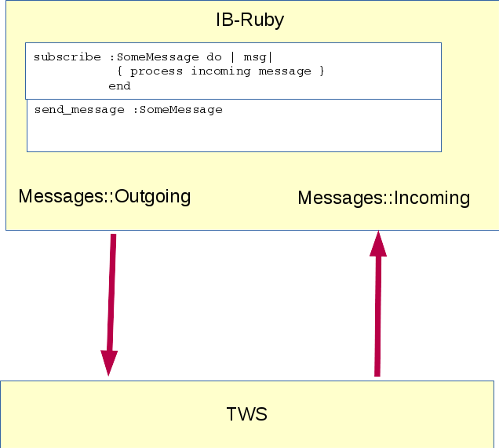

# IB-Ruby

Ruby Implementation of the Interactive Brokers Trader Workstation (TWS) API.


## SUMMARY:

This is a pure Ruby implementation of Interactive Brokers API. It uses socket API directly. 
So it does not have any dependencies other than TWS/Gateway itself. API Version 973.04  is supported. 

Why Ruby? Many people are put off by the amount of boilerplate code/plumbing required
by Python, Java, ActiveX or C++ API to do even the simplest of things, like getting account
data and placing/monitoring orders. This library intends to keep all the fluff away
and let you focus on writing your business logics, rather than useless boilerplate.

No more endless definitions of obligatory methods you'd never need, no spaghetti code
to divide your execution flow between multiple callbacks and interfaces.

Instead, a very simple paradigm is offered: your code interacts with the server
(TWS or Gateway) via exchange of messages. You subscribe to the server messages
that you're interested in, and send messages to server that request specific data
from it. You wait for specific messages being received, or other conditions you
define. The execution flow is under your control, rather than delegated somewhere.

Using this clear paradigm, you can hack together a simple automation of your
daily TWS-related routine in just a couple of minutes. Alternatively, you can
create a mechanical trading system with complex order processing logics, that
contains 1/10th of code and is 500% more maintaineable than it is possible with
other API implementations. The choice is yours.

## API v.9.72+ & Inclusion of Gateway-Application
The master-branch covers the most recent versions of Ruby and TWS. Ruby 2.4 and TWS Vers. 969 
are needed. It provides active-model objects which behave as thread-safe and lightweight acitve-record's. 

`IB-Ruby Core`(IB::Connection) serializes any response from the TWS into a `received`-Array. Its not intended for 24/7-applications but ideal for quick-queries. [IB::Gateway]( https://github.com/ib-ruby/ib-ruby/wiki/Gateway) provides a ready-to-go solution for reliable automated claims. 

## Simple Monitor Demo Application
__`IB-Ruby`__ integrates easily into common Web-Frameworks. This is demonstrated in the [Simple-Monitor](https://github.com/ib-ruby/simple-monitor) Application. It displays current portfolio positions and some account-measures in any browser. 


## INSTALLATION:

    $ git clone https://github.com/ib-ruby/ib-ruby
    $ cd ib-ruby
    $ bundle install; bundle update
    
    or
    
    specify in Gemfile:
    
    gem ib-ruby,  :git=> 'git://github.com/ib-ruby/ib-ruby.git'
    
 Detailed documentation: [wiki](https://github.com/ib-ruby/ib-ruby/wiki/Setup-Ruby-and-Install-the-Program) 
 
## PREREQUISITES:

0. A Ruby Interpreter, at least Version 2.4. We recommend Version 2.5 or above.

1. Install Interactive Brokers connectivity software: either
   [TWS](https://www.interactivebrokers.com/en/index.php?f=14099#tws-software) or
   [Gateway](https://www.interactivebrokers.com/en/index.php?f=16454)

2. Configure the software to allow API connections from the computer you plan to run
   `IB-Ruby` on, which is typically localhost (127.0.0.1) if you're running ib-ruby on
   the same machine as TWS/Gateway. [Here](http://www.youtube.com/watch?v=53tmypRq5wI)
   you can see how this is done for TWS.

3. Make sure sure your `IB-Ruby` gem version is compatible with your software version.
   As a rule of thumb, most recent `IB-Ruby` gem only supports latest versions of
   TWS/Gateway API. Older versions of API are supported by previous gem versions:

    | ib-ruby gem | TWS version | API version  |
    |:------------|------------:|:------------:|
    | 0.9.2       |    931-     |    967 final |
    | 0.9.5+      |    968      |    971       |
    | master-branch |  969      |    972+      |
  
4. Start Interactive Broker's Trader Work Station or Gateway before your code
   attempts to connect to it. Note that TWS and Gateway listen to different ports,
   this library assumes connection to Gateway on the same machine (localhost:4002)
   by default, this can be changed via :host and :port options given to `IB::Connection.new` or `IB::Gateway.new`.

## SYNOPSIS:
To play around, a [Console-App]( https://github.com/ib-ruby/ib-ruby/wiki/Console) is included. Change to the bin-directory and run 

```  
  ./console.rb  ("t" if a tws(GUI) is running on localhost)
```

After startup, `IB-Ruby` is running, the Connection ist active and accessible via the global Constant »`C`».
Any outgoing message to send, any subscription to incomming messages can be initialized. (Details in [Wiki(Console)](https://github.com/ib-ruby/ib-ruby/wiki/Console))

By default, any response from TWS is stored in the `Connection.received`-Hash.
It is easily inspected in the [Console](https://github.com/ib-ruby/ib-ruby/wiki/Console)

``` ruby
C.received.keys
 => [:OpenOrder, :OrderStatus, :OpenOrderEnd, :ManagedAccounts, :NextValidId, :Alert]

C.received[:OpenOrder].size
 => 3 

C.received[:OpenOrder].contract.to_human
 => ["<Stock: GE USD>", "<Bag: IECombo SMART USD legs: 9408|-1,43645865|1 >", "<Stock: WFC USD>"] 

C.received[:OpenOrder].status
 => ["Submitted", "PreSubmitted", "PreSubmitted"]

``` 

This is an example of your script that requests and prints out account data, then
places limit order to buy 100 lots of WFC and waits for execution. All in about 10
lines of code - and without sacrificing code readability or flexibility.
``` ruby
    require 'ib'

    ib = IB::Connection.new( port: 7497 ) do | gw |
      gw.subscribe(:Alert, :AccountValue) { |msg| puts msg.to_human }
      gw.subscribe(:OpenOrder) { |msg| puts "Placed: #{msg.order}!" }
      gw.subscribe(:ExecutionData) { |msg| puts "Filled: #{msg.execution}!" }
    end

    ib.send_message :RequestAccountData, account_code: 'U123456'

    ib.wait_for :AccountDownloadEnd

    contract = IB::Stock.new symbol: 'WFC'
                                   
    buy_order = IB::Limit.order size: 100, price: 21.00, action: :buy, 
                                tif: :good_till_cancelled, account_code: 'U123456'
   
    ib.place_order buy_order, contract
    ib.wait_for :ExecutionData
```
_([wiki -> place the order](https://github.com/ib-ruby/ib-ruby/wiki/place_the_order) contains a solution that fetches the market price
of the asset and proposes this as base for the setting of the order-price.)_


## CONTRIBUTING:

If you want to contribute to ib-ruby development:

1. Make a fresh fork of ib-ruby (Fork button on top of Github GUI)
2. Clone your fork locally (git clone /your fork private URL/)
3. Add main ib-ruby repo as upstream (git remote add upstream git://github.com/ib-ruby/ib-ruby.git)
4. Create your feature branch (git checkout -b my-new-feature)
5. Modify code as you see fit
6. Commit your changes (git commit -am 'Added some feature')
7. Pull in latest upstream changes (git fetch upstream -v; git merge upstream/master)
8. Push to the branch (git push origin my-new-feature)
9. Go to your Github fork and create new Pull Request via Github GUI

... then proceed from step 5 for more code modifications...

<hr>
Copyright (C) 2006-2018 Paul Legato, Wes Devauld, Ar Vicco and Hartmut Bischoff.

https://github.com/ib-ruby/ib-ruby

__WARNING:__ This software is provided __AS-IS__ with __NO WARRANTY__, express or
implied. Your use of this software is at your own risk. It may contain any number
of bugs, known or unknown, which might cause you to lose money if you use it.
You've been warned.

This code is not sanctioned or supported by Interactive Brokers.


## LICENSE:

This software is available under the LGPL.

This library is free software; you can redistribute it and/or modify
it under the terms of the GNU Lesser General Public License as
published by the Free Software Foundation; either version 2.1 of the
License, or (at your option) any later version.

This library is distributed in the hope that it will be useful, but
WITHOUT ANY WARRANTY; without even the implied warranty of
MERCHANTABILITY or FITNESS FOR A PARTICULAR PURPOSE. See the file LICENSE
for full licensing details of GNU Lesser General Public License.

You should have received a copy of the GNU Lesser General Public
License along with this library; if not, write to the Free Software
Foundation, Inc., 51 Franklin Street, Fifth Floor, Boston, MA
02110-1301 USA

